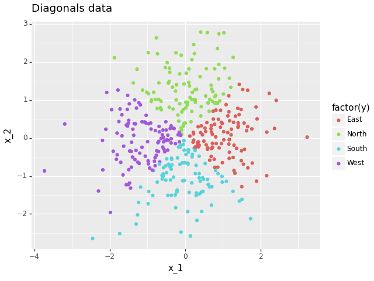

# BasicNeuralNetwork

This project provides a framework for using neural networks to solve classification and regression problems with n-dimensional datapoints.

## Background
For this section, we give a brief overview of how neural networks work.
Given a set of labelled datapoints, our goal is to use a neural network to learn the features of the dataset and accurately predict the labels of the points.

### Network
This network is made up of an input layer (one neuron for each coordinate of the data), some hidden layers and an output layer.
The output layer has either one neuron for regression problems, or the number of classes for classification. Below is an example network
from `examples/classification/circle` produced using the `networkx` package.

### Learning
Once a network is set up, with node values, biases and edge weights initialised, learning can begin. A subset of the data is used for training the network,
where each datapoint is passed through and a prediction of the class or regressional value is outputted. This value is then compared to the true value,
and the network updates the weights and biases via back propagation. This whole process occurs for multiple epochs with the goal of minimising the error.

After this, a different, unseen subset of the data is passed to the network to test how well it performs on new data.

## Installation
This package can be downloaded from github to your local machine via the following terminal command:

``
git clone git@github.com:mghosh00/BasicNeuralNetwork.git
``

From here, navigate to the newly created repository, and enter

``
pip install -e .
``

to pip install the package.

## Creating an example
There are a few different ways of creating an example. In this section, we demonstrate creating a new directory in the `examples` folder, but if you prefer
`jupyter notebook`, see `examples/notebooks/circle/circle.ipynb` for a different walkthrough.

Here, we use `examples/diagonals` as our example, which has data in the $x-y$ plane split into 4 classes for North, East, South and West.
First, create a directory named `diagonals` in the `examples` folder (or in your own new folder if you prefer).
### Generating data
To generate your own data, create the file `generate_diagonals_data.py`. From here, import one of the data generators, say
`NormalDataGenerator`, which takes the following arguments:

| argument         | type          | description                                                                                                                                                                   |
|------------------|---------------|-------------------------------------------------------------------------------------------------------------------------------------------------------------------------------|
| `function`       | `Callable`    | This `function` takes in the coordinates of the datapoint as arguments, and returns either a discrete class or value for classification and regression problems respectively. |
| `num_datapoints` | `int`         | The number of datapoints to be generated.                                                                                                                                     |
| `means`          | `List[float]` | The mean of each coordinate.                                                                                                                                                  |
| `std_devs`       | `List[float]` | The standard deviation of each coordinate.                                                                                                                                    |

For our example, the `function` takes in `x_1` and `x_2` as arguments, and returns `"North"`, `"East"`, `"South"` or `"West"`, depending on where the point lies on the grid. 

``
def classifier(x_1: float, x_2: float) -> str:
    if x_1 + x_2 > 0:
        if x_1 - x_2 > 0:
            return "East"
        else:
            return "North"
    else:
        if x_1 - x_2 > 0:
            return "South"
        else:
            return "West"
``

Next, we feed this to the `NormalDataGenerator` with `400` datapoints and means of [`0.0`, `0.0`], std_devs of [`1.0`, `1.0`] to get the following data:

This is from the dataframe returned by the `__call__` method of the data generator. We can then save this to a .csv file using `generator.write_to_csv("diagonals_data.csv")`.

### Using 

## Class Structure
Below is the UML class diagram for this package, created using [VisualParadigm](https://online.visual-paradigm.com).

