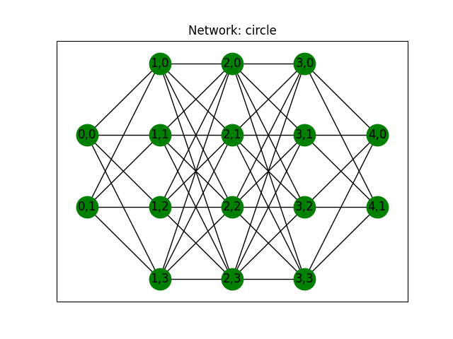
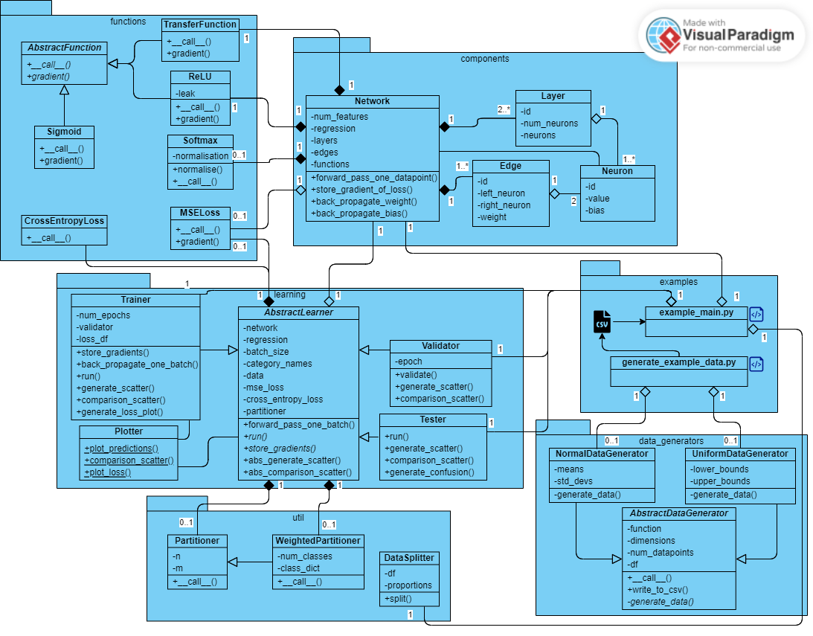

# BasicNeuralNetwork
[](https://github.com/mghosh00/BasicNeuralNetwork/actions/workflows/python_versions.yml)
[](https://neuralnetwork.readthedocs.io/en/latest/?badge=latest)
[](https://codecov.io/github/mghosh00/BasicNeuralNetwork)

This project provides a framework for using neural networks to solve classification and regression problems with n-dimensional datapoints.

## Background
For this section, we give a brief overview of how neural networks work.
Given a set of labelled datapoints, our goal is to use a neural network to learn the features of the dataset and accurately predict the labels of the points.

### Network
This network is made up of an input layer (one neuron for each coordinate of the data), some hidden layers and an output layer.
The output layer has either one neuron for regression problems, or the number of classes for classification. Below is an example network
from `examples/classification/circle` produced using the `networkx` package, with 1 input layer, 3 hidden layers and 1 output layer.



### Learning
Once a network is set up, with node values, biases and edge weights initialised, learning can begin. A subset of the data is used for training the network,
where each datapoint is passed through and a prediction of the class or regressional value is outputted. This value is then compared to the true value,
and the network updates the weights and biases via back propagation. This whole process occurs for multiple epochs with the goal of minimising the error.

After this, a different, unseen subset of the data is passed to the network to test how well it performs on new data.

## Installation
This package can be downloaded from github to your local machine via the following terminal command:

```console
git clone git@github.com:mghosh00/BasicNeuralNetwork.git
```

## Languages
This package is written in both python (pyNeuralNetwork) and Java (javaNeuralNetwork). See README.md in [pyNeuralNetwork](pyNeuralNetwork/README.md) and [javaNeuralNetwork]() for language-specific information and examples.

## Class structure
Below is the UML class diagram for this package, created using [VisualParadigm](https://online.visual-paradigm.com).



## Sources
[^1]: K. He et al., [Delving Deep into Rectifiers: Surpassing Human-Level Performance on ImageNet Classification](https://openaccess.thecvf.com/content_iccv_2015/html/He_Delving_Deep_into_ICCV_2015_paper.html), Proceedings of the IEEE International Conference on Computer Vision (ICCV), 2015, pp. 1026-1034
