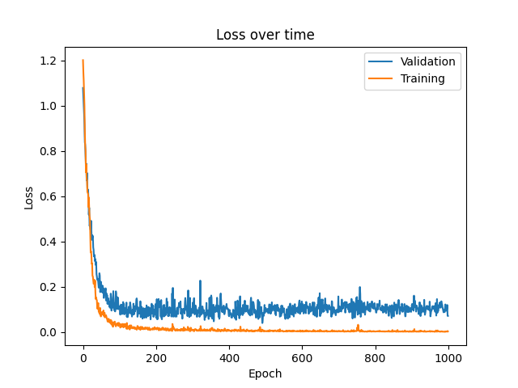

# BasicNeuralNetwork
[](https://github.com/mghosh00/BasicNeuralNetwork/actions/workflows/python_versions.yml)
[](https://neuralnetwork.readthedocs.io/en/latest/?badge=latest)
[](https://mghosh00.github.io/BasicNeuralNetwork/javadoc/)
[](https://codecov.io/github/mghosh00/BasicNeuralNetwork)

This project provides a framework for using neural networks to solve classification and regression problems with n-dimensional datapoints.

## Background
For this section, we give a brief overview of how neural networks work.
Given a set of labelled datapoints, our goal is to use a neural network to learn the features of the dataset and accurately predict the labels of the points.

### Network
This network is made up of an input layer (one neuron for each coordinate of the data), some hidden layers and an output layer.
The output layer has either one neuron for regression problems, or the number of classes for classification. Below is an example network
from `examples/classification/circle` produced using the `networkx` package, with 1 input layer, 3 hidden layers and 1 output layer.


### Learning
Once a network is set up, with node values, biases and edge weights initialised, learning can begin. A subset of the data is used for training the network,
where each datapoint is passed through and a prediction of the class or regressional value is outputted. This value is then compared to the true value,
and the network updates the weights and biases via back propagation. This whole process occurs for multiple epochs with the goal of minimising the error.

After this, a different, unseen subset of the data is passed to the network to test how well it performs on new data.

## Installation
This package can be downloaded from github to your local machine via the following terminal command:

```console
git clone git@github.com:mghosh00/BasicNeuralNetwork.git
```

From here, navigate to the newly created repository, and enter

```console
pip install -e .
```

to pip install the package.

## Creating an example
There are a few different ways of creating an example. In this section, we demonstrate creating a new directory in the `examples` folder, but if you prefer
`jupyter notebook`, see `examples/notebooks/circle/circle.ipynb` for a different walkthrough.

Here, we use `examples/diagonals` as our example, which has data in the $x-y$ plane split into 4 classes for North, East, South and West.
First, create a directory named `diagonals` in the `examples` folder (or in your own new folder if you prefer).

### Generating data
Next, you can either use one of the helper classes to generate some data, or use your own. We demonstrate both ways below.

To utilise the helper classes, first create the file `generate_diagonals_data.py`. From here, import one of the data generators, say
`NormalDataGenerator`, which takes the following arguments:

| argument         | type          | description                                                                                                                                                                   |
|------------------|---------------|-------------------------------------------------------------------------------------------------------------------------------------------------------------------------------|
| `function`       | `Callable`    | This `function` takes in the coordinates of the datapoint as arguments, and returns either a discrete class or value for classification and regression problems respectively. |
| `num_datapoints` | `int`         | The number of datapoints to be generated.                                                                                                                                     |
| `means`          | `List[float]` | The mean of each coordinate.                                                                                                                                                  |
| `std_devs`       | `List[float]` | The standard deviation of each coordinate.                                                                                                                                    |

For our example, the `function` takes in `x_1` and `x_2` as arguments, and returns `"North"`, `"East"`, `"South"` or `"West"`, depending on where the point lies on the grid. 

```
def classifier(x_1: float, x_2: float) -> str:
    if x_1 + x_2 > 0:
        if x_1 - x_2 > 0:
            return "East"
        else:
            return "North"
    else:
        if x_1 - x_2 > 0:
            return "South"
        else:
            return "West"
```

Next, we feed this to the `NormalDataGenerator` with `400` datapoints and means of `[0.0, 0.0]`, std_devs of `[1.0, 1.0]`. Use the `__call__` method of the generator,
followed by `generator.plot_datapoints("diagonals")` to get the plot below:


We can then save this data to a .csv file using `generator.write_to_csv("diagonals_data.csv")`.

### Using externally generated data
If you wish to instead use your own data not generated by one of the helper methods, simply put it in the following .csv format (titles unimportant):

| `x_1` | ... | `x_n` | `y`       |
|-------|-----|-------|-----------|
| `0.1` | ... | `0.8` | `Class B` |
| `0.4` | ... | `0.5` | `Class A` |
| `0.6` | ... | `0.1` | `Class B` |
| ...   | ... | ...   | ...       |

In the above table, each row represents a single datapoint with `n` coordinates `x_1`, ..., `x_n`. `y` represents either the class or value of the datapoint.
The `x_i` and `y` entries must be of the following types:

| variable | problem                      | type                        |
|----------|------------------------------|-----------------------------|
| `x_i`    | classification or regression | `int` or `float`            |
| `y`      | classification               | `int`, `float`, `str`, etc. |
| `y`      | regression                   | `int` or `float`            |

### Splitting data and constructing the network
Once we have our data in a .csv file, we can begin learning. Within the `diagonals` directory, create a new file named `diagonals_main.py`.
From here, import the `DataSplitter` which will randomly split our data into training, validation and testing according to some proportions.

```
data_splitter = DataSplitter(path="diagonals_data.csv", proportions=[8, 1, 1]) 
training_data, validation_data, testing_data = data_splitter.split()
```

After this, we can instantiate our `network`, which accepts the following parameters to its constructor:

| parameter           | type        | description                                                                                               | default  |
|---------------------|-------------|-----------------------------------------------------------------------------------------------------------|----------|
| `num_features`      | `int`       | The number of features (x coordinates) per datapoint.                                                     | ---      |
| `num_hidden_layers` | `int`       | The number of hidden layers of the network.                                                               | ---      |
| `neuron_counts`     | `List[int]` | The number of neurons in each hidden layer.                                                               | ---      |
| `num_classes`       | `int`       | The number of classes in the data for a classification problem. This parameter is ignored for regression. | `2`      |
| `regression`        | `bool`      | `True` corresponds to regression, `False` is classification.                                              | `False`  |
| `leak`              | `float`     | The leak for the ReLU function. Choose `0` for no leak.                                                   | `0.01`   |
| `learning_rate`     | `float`     | The learning rate for the network.                                                                        | `0.01`   |
| `adaptive`          | `bool`      | Whether we wish to have an adaptive learning rate or not (using momentum).                                | `False`  |
| `gamma`             | `float`     | The adaptive learning rate parameter. This is ignored if `adaptive` is `False`                            | `0.9`    |
| `he_weights`        | `bool`      | Whether we wish to initialise the weights of the network according to He or not [^1].                     | `False`  |

Here is an example below, which we will use for the `diagonals` data:

```
network = Network(num_features=2, num_hidden_layers=2, neuron_counts=[4, 4], 
                  num_classes=4, adaptive=True, he_weights=True) 
```

Note that only the first 3 parameters are required.

### Learning
For the learning, we now create three separate learners: the `trainer`, `validator` and `tester`. They accept the following parameters to their constructors:

| parameter    | type           | description                                           | default |
|--------------|----------------|-------------------------------------------------------|---------|
| `network`    | `Network`      | Our network from above.                               | ---     |
| `data`       | `pd.DataFrame` | The data for the specific phase.                      | ---     |
| `batch_size` | `int`          | The batch size we wish to use.                        | ---     |
| `weighted`   | `bool`         | Whether we want weighted or unweighted batches.       | `False` |
| `validator`  | `Validator`    | **TRAINER ONLY** - the already instantiated validator | `None`  |
| `num_epochs` | `int`          | **TRAINER ONLY** - the number of epochs to train for. | ---     |

Continuing with the `diagonals` example, these are our learners:

```
validator = Validator(network, validation_data, batch_size=10)
trainer = Trainer(network, training_data, num_epochs=1000, batch_size=16, weighted=True, validator=validator)
tester = Tester(network, testing_data, batch_size=10)
```

Now, we can run the `trainer` and `tester`! Note that the `validator` is run by the `trainer`.

``` 
trainer.run()
tester.run()
```

### Plotting the results
There are various methods that can be used to analyse the results.

Using `trainer.generate_loss_plot(title='diagonals')`, we can plot the loss of the training and validation over time.



All three learners have a `generate_scatter` method which also accepts a title as an argument. This method shows the predicted classes for the data.


The `tester` also has a `generate_confusion` method, which will print out the confusion matrix and dice scores for the data. This is only for classification problems,
but for regression there are other plotting methods as well.


## Class structure
Below is the UML class diagram for this package, created using [VisualParadigm](https://online.visual-paradigm.com).


## Sources
[^1]: K. He et al., [Delving Deep into Rectifiers: Surpassing Human-Level Performance on ImageNet Classification](https://openaccess.thecvf.com/content_iccv_2015/html/He_Delving_Deep_into_ICCV_2015_paper.html), Proceedings of the IEEE International Conference on Computer Vision (ICCV), 2015, pp. 1026-1034
